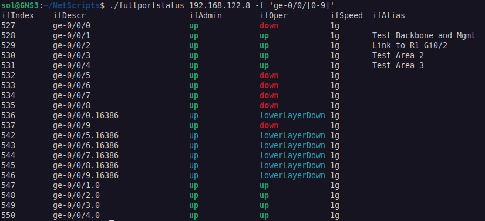
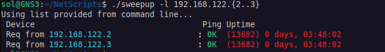
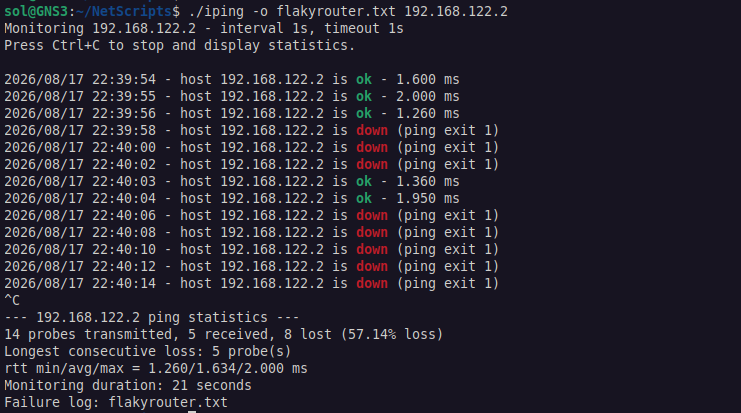
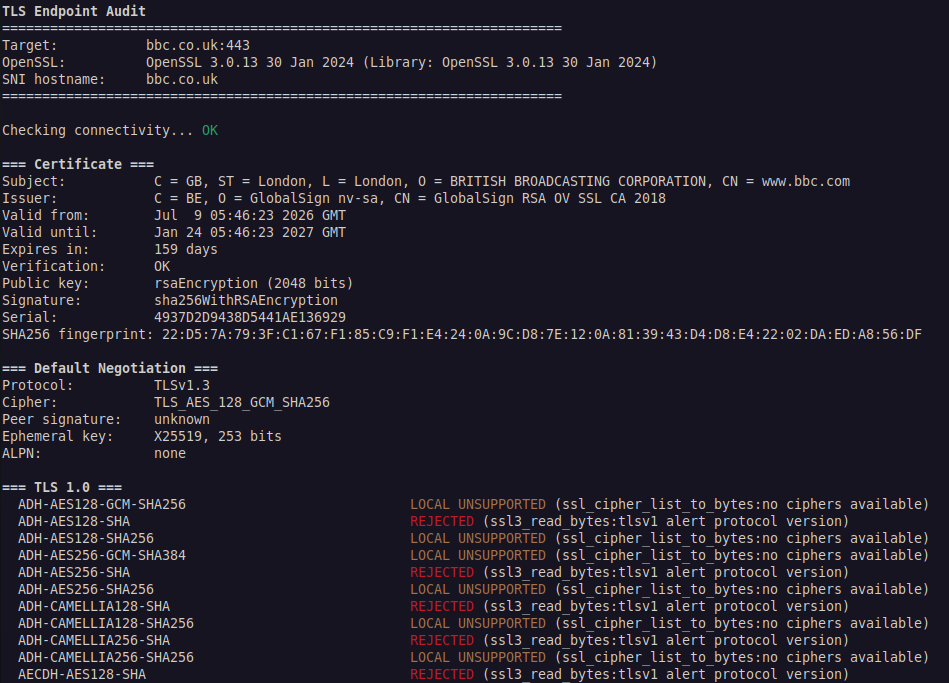
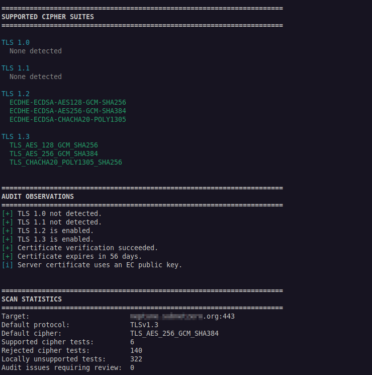

# Netscripts

This is a selection of portable bash scripts used for network
support/engineering purposes.

- fullportstatus    Quick status of all ports on a device
- sweepup           Sweep uptime of devices + stack status if desired
- iping             Continuous pinger for monitoring intermittent issues
- tls-audit         TLS audit for supported ciphers on endpoints

Use at your own risk etc etc, no liability accepted.

## fullportstatus

By running this with -n you can audit a bunch of devices before and after major works
to make sure things look the same. Eg:

```text
for host in 192.168.122.{2..3}; 
do echo "=== $host ==="; ./fullportstatus -n "$host" ; done | tee port-audit-before.txt
```

Repeating the above with a port-audit-after.txt then lets you do:

```text
vimdiff port-audit-before.txt port-audit-after.txt
```

Usage Details:

```text
Usage: ./fullportstatus [options] devicename
       ./fullportstatus [options] -h devicename

Options:
 -3          use SNMPv3 creds set in script
 -l          use low-speed ifSpeed OID for older devices
 -n          do not colourise
 -f 'regex'  show only interfaces whose ifDescr matches regex
 -h name     specify hostname

The -f option accepts a POSIX awk extended regular expression.
Quoting the expression is recommended to prevent shell expansion.

Examples:
  ./fullportstatus router1
  ./fullportstatus -n router1
  ./fullportstatus router1 -f '^GigabitEthernet'
  ./fullportstatus -f '^ge-' router2
  ./fullportstatus -f '^ge-[0-9]+/[0-9]+/[0-9]+$' router2
```



## sweepup

```text
Usage: ./sweepup {-v3} {-e} {-s} {-f filename} {-c community} {-l list of devices} {string}
```




## iping

Monitor a host for intermittent packet loss and latency.

```text
Usage: iping [options] HOST

Options:
  -4              Force IPv4
  -6              Force IPv6
  -c COUNT        Stop after COUNT probes
  -i SECONDS      Interval between probes (default: 1)
  -W SECONDS      Reply timeout (default: 1)
  -o FILE         Log failures/events to FILE
  -q              Quiet mode; don't print successful probes
  -n              Use numeric ping output
  -h              Show this help

Examples:
  iping router.example.com
  iping -c 100 192.0.2.1
  iping -i 5 -W 2 router.example.com
  iping -q -o flaky.log router.example.com
  iping -6 2001:db8::1
```




## tls-audit

TLS Testing Tool.

```text
Usage:
  tls-audit [options] <hostname> [port]

Options:
  -s, --summary       Show summary only
  -j, --json          Output JSON
  -c, --csv           Output CSV
      --no-delay      Do not pause between cipher tests
      --no-colour     Disable coloured output
      --no-color      Same as --no-colour
  -h, --help          Show this help

Environment:
  OPENSSL=/path       OpenSSL binary to use
  DELAY=seconds       Delay between cipher tests (default: 0.1)

Examples:
  tls-audit example.com
  tls-audit example.com 8443
  tls-audit --summary example.com
  tls-audit --json example.com > result.json
  tls-audit --csv example.com > result.csv

Exit codes:
  0   Scan completed; no audit issues detected
  1   Scan completed; audit issues detected
  2   Connection or TLS handshake failed
  3   Usage/local dependency error
```

Normal Mode:


Summary Mode:

